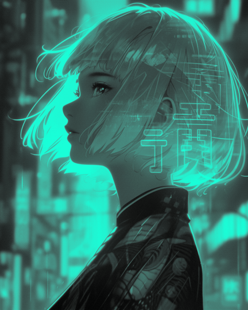

# Image Studio

Welcome to my Image Studio repo!

This repo is a pet project of mine where I code a range of different image processing techniques. 
The main goal is to learn more about image processing by coding certain techniques by hand rather than 
using existing libraries. 

## Showcase 

### Quantization and Dithering

Reduces the color palette from 8-bit to an arbitrary range. Works with both grayscale and RGB images XD

The dithering is either done with the [Floyd-Steinberg dithering algorithm](https://en.wikipedia.org/wiki/Floyd%E2%80%93Steinberg_dithering) or the [Ordered Dithering algorithm](https://en.wikipedia.org/wiki/Ordered_dithering). Dithering works by distributing pixels in a way that makes the image appear to have more colors than it actually does. This creates the illusion of a wider color palette.

| **Category**         | **Original Image**                                          | **Quantized  Image (4 Colors)**                                   | **Quantized Image (4 Colors) + Dithering (Ordered Dithering)**| **Quantized Image (4 Colors) + Dithering (Floyd-Steinberg Dithering)**|
|----------------------|----------------------------------------------------|----------------------------------------------------|-----------------------------------------------------|-----------------------------------------------------|
| **Dog (Grayscale)**  |      |              |             |  |
| **Dog (RGB)**     |        |            |          |  |
| **Duck (Grayscale)**      |            |                    |                   |                   |
| **Duck (RGB)**      |           |             |           |           |

### Color Palette Conversion

This functionality works as a [Color LUT](https://en.wikipedia.org/wiki/3D_lookup_table). The original image is converted to grayscale, dithered to remove color banding, and then a color LUT maps each grayscale value to a different HSV value. The core idea is to associate color with a single channel in the image - rather than 3 channels, like it is with RGB. For this reason, I used the [HSV colorspace](https://en.wikipedia.org/wiki/HSL_and_HSV).

After a Hue is specified with the -p option, a color LUT for that Hue will be created on-the-fly. Currently it only suports color palettes of a single Hue.

Some examples:

**Original Image (Credit to [Keith Griego](https://www.artstation.com/keithgriego) on Artstation) - 16 Million Colors** 

**Cyan Color Palette - 32 Colors**

**Green Color Palette - 32 Colors**

### Running the code

Install the dependencies with

    pip install -r requirements.txt

Next, run the code with

    python3 main.py -i path/to/image

You can specify what operations you want by the command line.  For example, to quantize an image with 8 colors and use dithering, you could run

    python3 main.py -i path/to/image --quantize 8 --dithering

The file [include/parser.py](include/parser.py) displays all the valid operations.