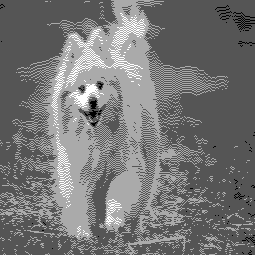
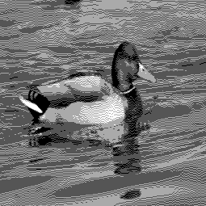
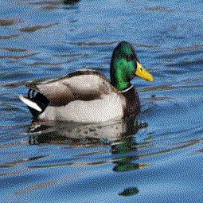

# Image Studio

Welcome to my Image Studio repo!

This repo is a pet project of mine where I code a range of different image processing techniques. 
The main goal is to learn more about image processing by coding certain techniques by hand rather than 
using already established libraries. 

## Showcase 

### Quantization and Dithering

Reduces the color palette from 8-bit to an arbitrary range. Works with both grayscale and RGB images XD

The dithering is done with the [Floyd-Steinberg dithering algorithm](https://en.wikipedia.org/wiki/Floyd%E2%80%93Steinberg_dithering). The algorithm works by distributing the quantization errors to neighboring pixels in a way that makes the image appear to have more colors than it actually does. This creates the illusion of a wider color palette.

| **Category**         | **Original Image**                                          | **Quantized  Image (4 Colors)**                                   | **Quantized Image (4 Colors) + Dithering**                                    |
|----------------------|----------------------------------------------------|----------------------------------------------------|-----------------------------------------------------|
| **Dog (Grayscale)**  |      |              |             |
| **Dog (RGB)**     |        |            |          |
| **Duck (Grayscale)**      |            |                    |                   |
| **Duck (RGB)**      |           |             |           |

### Running the code

Install the dependencies with

    pip install -r requirements.txt

Next, run the code with

    python3 main.py -i path/to/image

It is possible to specify what operations you want by the command line.  For example, to quantize an image with 8 colors and use dithering, you could run

    python3 main.py -i path/to/image --quantize 8 --dithering

The file [include/parser.py](include/parser.py) displays all the valid operations.