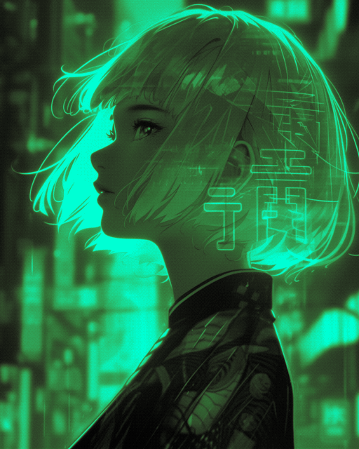

# Image Studio

Welcome to **Image Studio** 👋!

**Image Studio** is a pet project of mine where I code a range of different image processing techniques. My main goal here is to challenge myself and use only Numpy to implement image processing algorithms that I find interesting.

I have also written a [Wiki](https://github.com/RafaelAmauri/Image-Studio/wiki) for **Image Studio**. I use the Wiki to explain what some of the more complicated implementations do and also give examples of the implemented functionalities.

# Showcase 

## Color Palette Conversion 🎨

This feature works similarly to digital [Color Grading](https://en.wikipedia.org/wiki/Color_grading). 

Here's how it works:

**1. Quantization with Dithering**: The image is quantized, meaning we reduce the number of colors in it. We also
use dithering to avoid color banding.

**2. Conversion to HSV**: The image is converted to the HSV color model. This is because in HSV the color is associated with
a single channel - the Hue (H) channel, unlike in RGB where color information is spread across 3 different channels. This makes it
way easier to manipulate color information.

**3. Color Mapping**: A [Color LUT](https://en.wikipedia.org/wiki/3D_lookup_table) (Lookup Table) maps each grayscale value to a specific HSV value.

After a **Base Hue** is specified, a **color palette for that Hue will be created on-the-fly**.

It's also possible to specify a **Hue Range**. This controls how much the available hues in the color palette can deviate from the Base Hue. For more information, read the [Wiki Page](https://github.com/RafaelAmauri/Image-Studio/wiki/Color-Palette-Conversion#hue-range)!

### Some examples:

**Original Image, 16 Million Colors**

**Cyan Color Palette, 32 Colors**

**Pink Color Palette, 32 Colors**

**Original Image (Credit to Keith Griego on Artstation), 16 Million Colors**

**Green Color Palette, 32 Colors**

**Blue Color Palette, 32 Colors**

## Quantization and Dithering 🟥 🟩 🟦 🟧 🟪

**Quantization** works by reducing the number of colors in an image by grouping similar colors together.  **Quantizing the image without dithering causes major [Color Banding](https://en.wikipedia.org/wiki/Colour_banding)**.

**Dithering** is just a fancy way of doing quantization. It works by quantizing the image and then distributing the pixels in a way that creates the illusion of a wider color palette.

I have implemented two dithering algorithms:

* [Floyd-Steinberg algorithm](https://en.wikipedia.org/wiki/Floyd%E2%80%93Steinberg_dithering)

* [Ordered dithering](https://en.wikipedia.org/wiki/Ordered_dithering)

**Table of Comparisons**

| **Category**         | **Original Image**                                          | **Quantized  Image (4 Colors)**                                   | **Quantized Image (4 Colors) + Dithering (Ordered Dithering)**| **Quantized Image (4 Colors) + Dithering (Floyd-Steinberg Dithering)**|
|----------------------|----------------------------------------------------|----------------------------------------------------|-----------------------------------------------------|-----------------------------------------------------|
| **Dog (Grayscale)**  |      |              |             |  |
| **Dog (RGB)**     |        |            |          |  |
| **Duck (Grayscale)**      |            |                    |                   |                   |
| **Duck (RGB)**      |           |             |           |           |

## SIMD Acceleration 🚀

Working with images often requires performing operations on thousands of pixels. Since images are essentially large arrays of pixel data, and the same operations can be applied to many pixels at the same time, 
this makes them **ideal candidates for [SIMD acceleration](https://en.wikipedia.org/wiki/Single_instruction,_multiple_data)**.

Implementing SIMD acceleration often requires **major rewrites and optimizations**, and the process is often not very straightforward, but it is still very much worth it!

The speedup I got after implementing vectorization is massive. For reference, my Ryzen 7 5700X3D can **quantize**, **dither** and **convert the color palette of an 8K image in around 15 seconds**. 
Without vectorization, the same operations on the same image took over **20 minutes**. So, in a way, you could say that the code in this repo is **8K-ready**! 😁

⚠️ **Vectorization is not the same as multithreading**! Vectorization leverages **[Vector Processors](https://en.wikipedia.org/wiki/Vector_processor)** that exist on modern CPUs. 
These Vector Units are optimized for running SIMD code for multiple data at once. **However, SIMD acceleration still runs on a single CPU thread**!

On that note, theoretically speaking the speedup could be even greater if I also implemented **multithreading combined with vectorization** - which would distribute the workload across multiple CPU cores while still using 
SIMD acceleration in each core. However, since my current implementation already processes an **8K image in a very reasonable amount of time**, I haven't prioritized multithreading yet.

## Running the code 🛠️

1️⃣ Install the dependencies with

    pip install -r requirements.txt

2️⃣ Next, run the code with

    python3 main.py -i path/to/image

3️⃣ You can specify what operations you want by the command line.  For example, to quantize an image with 8 colors, you could run

    python3 main.py -i path/to/image --quantize 8

For a full list of available options, check out [include/parser.py](include/parser.py). This file contains all the valid operations.