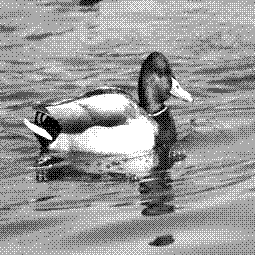

# Image Studio

Welcome to **Image Studio**!

This repo is a pet project of mine where I code a range of different image processing techniques. 
The main goal is to learn more about image processing by coding certain techniques by hand rather than 
using existing libraries. 

## Showcase 

### SIMD-Friendly 🚀

Working with images is a great candidate for taking advantage of [SIMD operations](https://en.wikipedia.org/wiki/Single_instruction,_multiple_data) since images are essentially large arrays of pixel data, the same operations can be applied to many pixels at the same time. 

This allows me to fully leverage SIMD with Numpy vectorization to make the code go really fast! I try to implement SIMD code in as much of the codebase as possible. I especifically chose Numpy for this because Numpy
implements its SIMD operations with CPU-centric C++ vectorization, meaning that the code works on a lot of different devices. The alternative would be to implement SIMD code that runs on the GPU, but since I have an Nvidia GPU, this
could lock out users with AMD and Intel GPUs because of CUDA. For this reason I chose to use Numpy, since this way the code remains fast and efficient across a wide range of devices, regardless of GPU vendor, keeping it truly GPU-agnostic.

### Color Palette Conversion 🎨

My color palette conversion works like digital [Color Grading](https://en.wikipedia.org/wiki/Color_grading). The original image is converted to grayscale, dithered to remove color banding, and then a [Color LUT](https://en.wikipedia.org/wiki/3D_lookup_table) maps each grayscale value to a different HSV value. The core idea is to associate color with a single channel in the image, rather than with 3 channels, like it is with RGB. This makes it easier to manipulate color, and for this reason I used the [HSV colorspace](https://en.wikipedia.org/wiki/HSL_and_HSV).

After a Hue is specified with the -p option, a color palette for that Hue will be created on-the-fly. Currently it only suports color palettes of a single Hue.

Some examples:

**Original Image (Credit to [Keith Griego](https://www.artstation.com/keithgriego) on Artstation) - 16 Million Colors** 

**Cyan Color Palette - 32 Colors**

**Green Color Palette - 32 Colors**

### Quantization and Dithering 🟦 🟧 🟩 ⬜

Quantization works by reducing the number of colors in an image.

Dithering works by distributing pixels in a way that makes the image appear to have more colors than it actually does. This creates the illusion of a wider color palette. I implemented two dithering algorithms: [Floyd-Steinberg algorithm](https://en.wikipedia.org/wiki/Floyd%E2%80%93Steinberg_dithering) or with [Ordered dithering](https://en.wikipedia.org/wiki/Ordered_dithering). 

| **Category**         | **Original Image**                                          | **Quantized  Image (4 Colors)**                                   | **Quantized Image (4 Colors) + Dithering (Ordered Dithering)**| **Quantized Image (4 Colors) + Dithering (Floyd-Steinberg Dithering)**|
|----------------------|----------------------------------------------------|----------------------------------------------------|-----------------------------------------------------|-----------------------------------------------------|
| **Dog (Grayscale)**  |      |              |             |  |
| **Dog (RGB)**     |        |            |          |  |
| **Duck (Grayscale)**      |            |                    |                   |                   |
| **Duck (RGB)**      |           |             |           |           |

### Running the code 🛠️

Install the dependencies with

    pip install -r requirements.txt

Next, run the code with

    python3 main.py -i path/to/image

You can specify what operations you want by the command line.  For example, to quantize an image with 8 colors, you could run

    python3 main.py -i path/to/image --quantize 8

Please check the file [include/parser.py](include/parser.py) displays all the valid options.